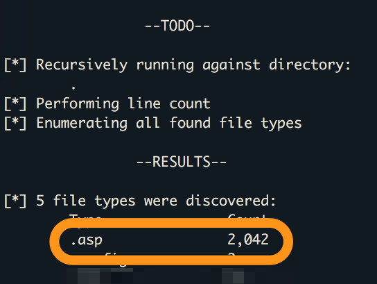
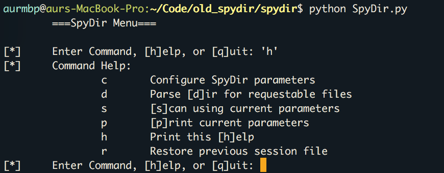
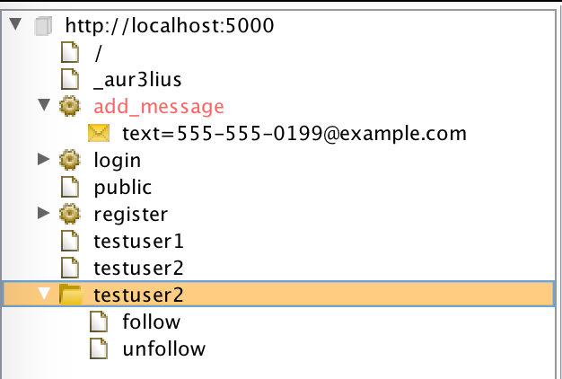
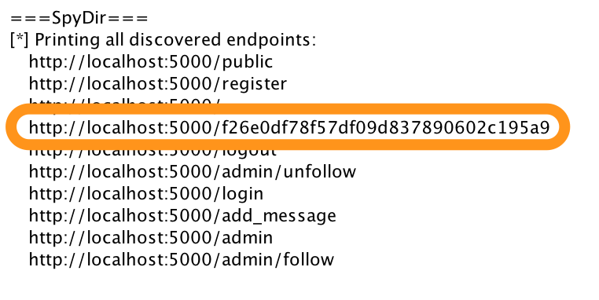
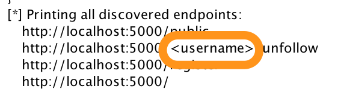
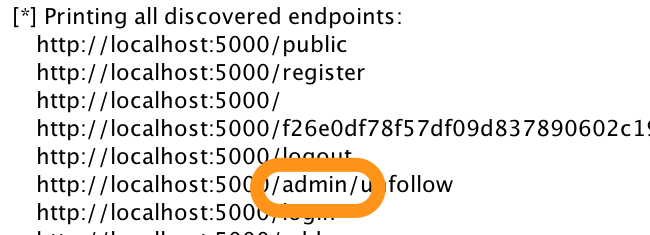

<!-- $theme: default -->

# Introduction to SpyDir
##### &nbsp;&nbsp;&nbsp;&nbsp;&nbsp;&nbsp;A BurpSuite Extension
By Ryan Reid

---

### `whoami`

- Senior Application Security Consultant [@nVisium](https://nvisium.com)
- Twitter: [@\_aur3lius](https://twitter.com/_aur3lius)
- Github: [aur3lius-dev](https://github.com/aur3lius-dev)
- Wanna-be-coder
- Hates repeating work

---

### `whoareyou`

Audience:

- AppSec - Hybrid assessments
- Devs - Inheriting legacy projects
- QA - Assisting the security team one auth boundary at a time

---

### Problem
What do I do if dynamic spidering isn't enough and I'm running out of time?

**Duh!** _Automate._

---

### Just use these, right?

* [DirBuster](https://www.owasp.org/index.php/Category:OWASP_DirBuster_Project)
* [BurpSuite Pro - Content Discovery](https://portswigger.net/burp/help/suite_functions_contentdiscovery.html)

These are awesome tools (if you don't have the source code)

---

### Another approach

Hybrid assessments:
* dynamic environment
* source code repo :heart:

Meaning: TONS of information

... Sometimes too much

---

### Okay... so I have source
Imagine an infinite abyss of seemingly forgotten Classic ASP project files
* That was my life once



---

### Growing time: Automation v1



---

### Features: Automation v1

Simple script that treated every file in a directory as an endpoint
* Worked but required a bit of overhead
	* Sessions tend to expire
		* Meaning: accidental authorization bounds checking
* Great for applications that server content directly: PHP, ASP, HTML, &c.

Provided a good way to quickly enumerate static content

---

### Idea v2

* Make the project more generalized and approachable
	* People seem to like UIs
* Finding a home
	* BurpSuite is love
* New functionality and ease of use

---

### SpyDir - A BurpSuite Extension

Let's spy on some directories for sweet, sweet, endpoints

A few things first
* Requirements:
	* BurpSuite (Free or Pro)
	- Jython 2.7

---

### Goals

* Approachable and available
* Find content the dynamic spider may have missed
	* Including more than just static content
* Report that information back to the user
* Pass those URLs to the BurpSuite Spider
* Provide a mechanism for further generalization

---

### Good ol' fashion spidering with Burp - Demo

_aka: easy mode_



---

### SpyDir - Demo

Did we miss anything while spidering with Burp?

1. Look for static resources we may have missed
2. Take a walk on the wild (source) side
3. Consume a text file with known endpoints



---

### Magical resources?!

No! Let's talk about plugins!

---

### Plugins

Written in python

Allow SpyDir to parse source code line-by-line to find endpoints

Generally use regex to find endpoints:
* Flask/Bottle: `r'@route\('`
* Spring MVC: `r'@RequestMapping\('`
* &c.

---

### Plugin requirements

* `run` function
	* takes a `[]` of lines
	* applies a regex (or other) against line to identify endpoint
	* `return` a list of endpoints
* `get_name` function
	* `return` name of plugin
* `get_ext` function
	* `return` expected extension type to parse

---

### Deep dive

Let's look at some code

---

### FlaskBottlesRoutes

Meets requirements, right? 
* `run`, `get_name`, and `get_ext` are present

Does a bit more too:
```
PATH_VARS = {'<username>': 'str'}

def handle_path_vars(var_names):
    ret_val = {}
    for var in var_names:
        if var in PATH_VARS.keys():
            if PATH_VARS[var] == "int":
                ret_val[var] = randint(0, 47)
            elif PATH_VARS[var] == 'str':
                ret_val[var] = "admin"
            # Define more based on need
            else:
                ret_val[var] = ""
    return ret_val
```

---

Before:



After:



---

#### Updates in the works

* Moar plugins
	* I write these as I have time and encounter frameworks
		* Let me know if you have requests
	* Feel free to write your own and make a pull request!
		* Easy as: `run`, `get_name`, and `get_ext`
* `POST` request processor
	* BurpSuite Spider only takes a Java `java.net.URL`
		* Can't pass `POST` parameters
	* Custom processor will add request and responses to sitemap 

---

#### Questions?
Feedback - please!

Newest version: https://github.com/aur3lius-dev/SpyDir

Also on the BApp store.